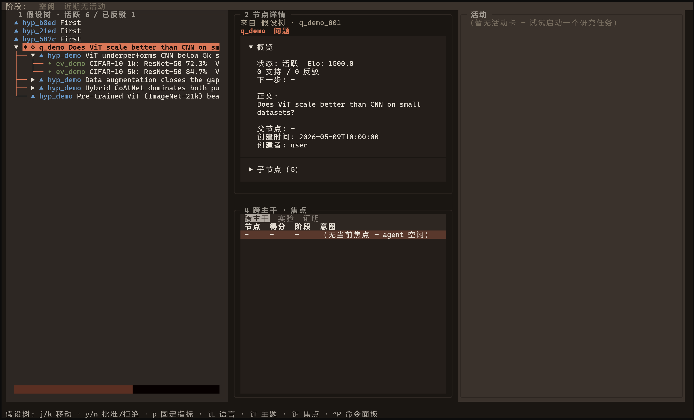

# ClaudeScientist

**A research co-pilot that remembers, verifies, and lets you steer.**

[](https://github.com/whenpoem/aiscientist/releases) [](https://www.python.org/) [](tests/) [](LICENSE)

> 中文版本: [README.zh-CN.md](README.zh-CN.md)

ClaudeScientist plugs into Claude Code or Codex and adds what most AI scientist systems leave out: it remembers what you've tried, verifies your numbers before you publish them, and gives you a live terminal dashboard where you can watch the research unfold and step in at any time.

You give the agent a research question. It generates hypotheses, ranks them in a tournament, runs experiments with built-in safety checks, and tracks provenance for every number it produces. You watch the whole process in a second terminal and can reject, redirect, or approve at any point.

**Current version**: v5.0.0 — the cockpit is now an "activity streaming" research monitor. The top of the screen shows a **phase strip** (`idle / explore / select / experiment / verify / prove / review / narrate`) derived live from `cockpit_events`; the main pane shows **activity cards** (one card per research action — a BT tournament, a proof diagnose loop, a Lean attempt) instead of a flat event firehose; a new **Focus tab** lists the node(s) the agent is working on right now. The original event stream is preserved as a collapsible audit log at the bottom (toggle with `A`). Two new optional MCP atomic tools — `cockpit__set_phase` and `cockpit__narrate` — let SOP-driven agents annotate decisions without coupling to the cockpit's rendering. No schema migration: phase / focus / activity are pure functions over the existing `cockpit_events` table, per [ADR 0011](docs/adr/0011-cockpit-activity-streaming.md) and [architecture.md §14](docs/architecture.md#14-cockpit-activity-streaming-v50).

**v4.2.0 features retained** (see [retrospective-v4.2.md](docs/retrospective-v4.2.md)): tab grouping into Cross / Empirical / Proof, collapsible detail sections, pane-scoped `w`/`i`/`t` keys, the multi-provider vector backend (DashScope / Jina / Voyage / GLM tested via [ADR 0010](docs/adr/0010-multi-provider-embeddings.md), default local `Qwen/Qwen3-Embedding-0.6B`), reports-as-files (closure / draft / diagnostic / portfolio / cascade) per [ADR 0009](docs/adr/0009-reports-as-files-monitoring-as-tui.md), and the cold-start Welcome screen. See [architecture.md §13](docs/architecture.md#13-core-vs-domain-trunks-v40) for the two-trunk split.

## What it looks like

Open two terminals side by side. That's the whole UI.

<picture>
  
</picture>

*The cockpit TUI — hypothesis tree, evidence, ratings, and event stream in one terminal.*

The two terminals don't talk to each other directly — they both read and write the same SQLite file. This is the central design choice: every module collaborates through a shared database, not over the network.

| Role | Where | What it does |
|---|---|---|
| **Claude Code / Codex** | Terminal A | Drives the research: understands your question, calls tools, writes and runs code |
| **MCP servers** | Background | Provide the tools the agent calls — memory, verification, literature search, proof generation |
| **Hooks** | Auto-loaded at startup | Run safety checks before/after every tool call (block data leaks, log provenance) |
| **Cockpit TUI** | Terminal B | Shows live state; lets you approve, reject, or redirect hypotheses |
| **SQLite** | `.research-agent/state.db` | The single file that holds all state: hypotheses, evidence, ratings, metrics, events |

## What you can do with it

- **Track your research thinking.** Every hypothesis, piece of evidence, and branching decision lives in a persistent graph. Papers you read along the way are compressed and searchable. Come back next week — it's all there. Want to revisit a direction you pruned? Run a counterfactual replay without touching the live state.
- **Rank competing ideas.** A Bradley-Terry tournament compares hypotheses head-to-head and produces a leaderboard with confidence intervals, so you know which direction is actually winning.
- **Lock your goalposts before experimenting.** Preregistration makes you commit to a metric, direction, and threshold before you see results. Multiple-comparison correction is applied automatically.
- **Make your numbers trustworthy.** Every reported number gets checked: Is it reproducible across random seeds? Which files produced it? Has anything changed since? Baseline comparisons are checked for fair compute budgets. A reviewer agent blocks any unverified claim from reaching a writeup.
- **Catch mistakes before they compound.** A failure ledger remembers every debugging session. Next time you hit a similar problem, the system surfaces how you fixed it before.
- **Watch and steer in real time.** The cockpit TUI shows the hypothesis tree, ratings, and event stream live. Press a key to reject a bad hypothesis or inject a note — interventions are picked up at the next turn.
- **Generate and verify statistical proofs** *(v4.0).* A proof trunk handles drafting, segmentation, diagnosis against known error patterns, and optional Lean 4 formal verification.

## Quick start

Install and run the setup wizard:

```powershell
uv sync
uv run python -m claudescientist.setup
```

The wizard walks you through AI client selection (`claude`, `codex`, or
`both`), embedding backend, proof corpus seeding, held-out directory, Lean
toolchain, and auto-prune — all in one pass. Run it again any time; it skips
steps that are already done.

For non-interactive setup, set `CLAUDESCIENTIST_SETUP_AGENT_HOST=codex` or
`CLAUDESCIENTIST_SETUP_AGENT_HOST=both`. Codex support is project-local: setup
generates `.codex/config.toml`, `.codex/agents/*.toml`, and repo skills under
`.agents/skills/` from the existing Claude Code assets.

Literature search uses two external MCPs. arXiv is launched through
`uv tool run arxiv-mcp-server`; OpenAlex is launched through
`npx -y openalex-research-mcp`, so install Node.js/npm if you want the
OpenAlex-backed librarian tools.

<details><summary>Manual setup (without the wizard)</summary>

```powershell
uv sync --extra proof    # pulls in sentence-transformers for the proof trunk
uv run python scripts/seed_proof_corpus.py
uv run python scripts/seed_proof_failures.py
```

</details>

Run — open two terminals from the repo root:

```powershell
# Terminal A: Claude Code (from the repo root)
claude

# Or Terminal A: Codex (after choosing codex/both in setup)
codex -C .

# Terminal B: cockpit TUI (from the repo root)
uv run python -m cockpit.tui
```

For the Chinese UI on Windows Terminal:

```powershell
chcp 65001
$env:PYTHONUTF8=1
uv run python -m cockpit.tui --lang zh
```

Press `L` inside the TUI to toggle English / Chinese labels.

In Codex, start ClaudeScientist skills with `/skills` or `$skill-name`.
Example:

```text
$research-sop investigate whether per-head dropout helps ViT scaling
```

In Codex, do not type `/research-sop`; that form is for Claude Code.
If `$research-sop` does not appear, check that `.agents/skills/research-sop/SKILL.md`
exists, restart Codex, and start it from the repository root.

Lean formal verification is a separate opt-in setup. In Codex, the generated
Lean MCP server is disabled until you finish that setup. See
[`docs/setup-lean.md`](docs/setup-lean.md).

## Where to go next

If you're new, read in this order:

1. **[`docs/overview.md`](docs/overview.md)** — the complete mental model: how the pieces fit, what happens end-to-end, the three design principles
2. **[`docs/workflows/first-research-task.md`](docs/workflows/first-research-task.md)** — walk through one full task from start to finish
3. **[`docs/architecture.md`](docs/architecture.md)** — the contracts between modules (treat as binding)
4. **[`docs/tool-reference.md`](docs/tool-reference.md)** — every MCP tool, with signature and usage guidance

More:

- Design rationale for each major decision → [`docs/adr/`](docs/adr/)
- Where the project is headed → [`docs/roadmap.md`](docs/roadmap.md)
- Historical plans → [`docs/archive/`](docs/archive/)
- Agent and contributor rules → [`AGENTS.md`](AGENTS.md)

## Runtime details

Default paths:

- Shared state: `.research-agent/state.db` under the repo root
- Generated reports: `reports/` under the repo root; gitignored by default,
  force-add individual files only when you intentionally want to share them
- Held-out datasets: `%USERPROFILE%\.research-agent\heldout`, configurable via `RESEARCH_AGENT_HELDOUT_DIR`
- Embedding backend: `local` (sentence-transformers/Qwen/Qwen3-Embedding-0.6B); override with `RESEARCH_AGENT_EMBED_BACKEND=mock|openai`. Tests use `mock` automatically.

Dev server commands for individual MCP modules:

```powershell
uv run python -m memory_mcp.dev_server
uv run python -m verify_mcp.dev_server
uv run python -m prove_mcp.dev_server
uv run python -m cockpit.mcp_server
uv run python -m claudescientist.heldout register <name> <path>
```

## Validation

Before shipping a change:

```powershell
uv run ruff check
uv run pytest tests/memory_mcp tests/verify_mcp tests/prove_mcp tests/hooks tests/cockpit tests/scripts tests/e2e
uv run python -m cockpit.tui --once --lang zh
uv run python -c "import memory_mcp.server; import verify_mcp.server; import prove_mcp.server; import cockpit.mcp_server; print('OK')"
```

## Current status

The repo works for local development and integration. A fresh end-to-end validation pass is needed before calling it production-ready.

A few things to know:

- **Auto-prune is dry-run by default.** Set `RESEARCH_AGENT_AUTO_PRUNE=1` to let it actually pause weak branches.
- **The cockpit is terminal-only.** No browser frontend, no web server.
- **The prover agent works without Lean.** The NL proof workflow runs on its own; Lean is extra insurance you can set up later via [`docs/setup-lean.md`](docs/setup-lean.md).
- **`mem_nodes.elo_score` is a legacy column.** New code should read `mem_bt_ratings.strength`.

Full tool list and scope details: [`docs/tool-reference.md`](docs/tool-reference.md) and [`AGENTS.md`](AGENTS.md).
