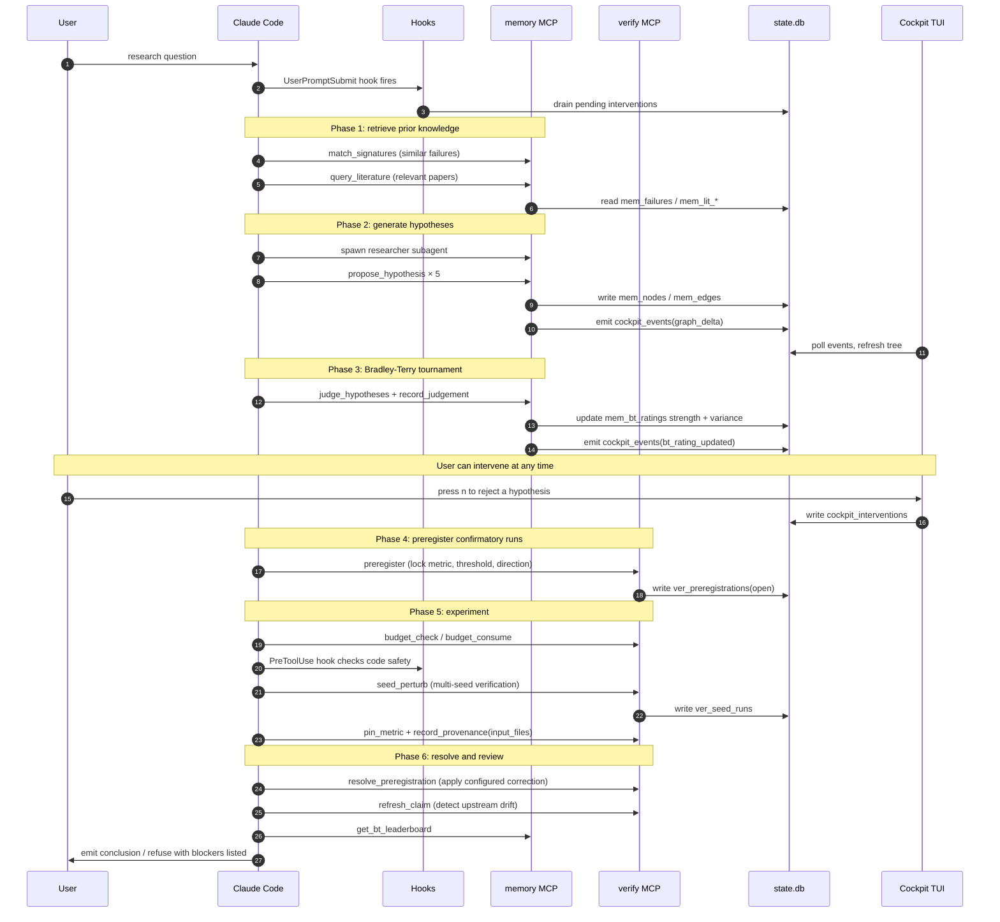
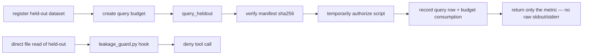

# ClaudeScientist System Overview

> 中文版本: [overview.zh-CN.md](overview.zh-CN.md)
> A short description of the components, stored data, and research workflow. Read this before [architecture.md](architecture.md) and [tool-reference.md](tool-reference.md).

## 1. One-line positioning

ClaudeScientist adds persistent research records, experiment verification,
user intervention, and a real-time terminal interface to Claude Code or Codex.

The AI client already handles dialogue, planning, and tool invocation. This
project fills in four things on top: **memory, verification, statistical proof
generation, and a cockpit**.

## 2. What you actually see

Open two terminal windows side by side:

```
┌─────────────────────────┐  ┌─────────────────────────┐
│  Terminal A: Agent CLI  │  │  Terminal B: Cockpit    │
│  Claude Code or Codex   │  │  TUI (monitor/intervene)│
│                         │  │                         │
│  > see commands below   │  │  ┌─ Hypothesis tree ┐   │
│  AI thinks, calls tools │  │  │ ▾ Q ViT scale    │   │
│  AI writes/runs code    │  │  │   ▸ H_07 ...     │   │
│                         │  │  │   ▸ H_08 ...     │   │
│                         │  │  └──────────────────┘   │
│                         │  │  press n=reject y=ok    │
└─────────────────────────┘  └─────────────────────────┘
            │                            │
            └────────┬───────────────────┘
                     ▼
        .research-agent/state.db   ← one SQLite file
```

**The main point**: the two terminals **do not communicate directly**. Both read
and write the same SQLite file. The modules therefore share state through a
local database file rather than through a network service.

### What each terminal answers (v5.0)

The two terminals look superficially similar — both show "what the AI
is doing" — but they answer different questions on different time
scales. Knowing which to look at where keeps the dual-view from
feeling redundant.

| Aspect | Terminal A (Claude Code / Codex) | Terminal B (Cockpit) |
|---|---|---|
| Granularity | Each tool call, each thinking block | Research-phase, focus node, activity card |
| Time scale | Real-time token-by-token | Last 30 minutes, phase-by-phase |
| What it shows | Claude's natural-language response + tool I/O | Derived state: phase strip + activity cards + focus tab |
| What it does NOT show | Cross-trunk current focus, recent reject/redirect interventions | Claude's specific thinking text, file diffs |
| What you do here | Reply to Claude, Ctrl-C to halt | Reject / approve / inject note / queue intervention |
| Storage | AI client session state | `.research-agent/state.db` (single SQLite) |
| User action | Reply to the agent | Review current state and submit interventions |

Terminal A shows the current conversation and tool calls. Terminal B summarizes
the stored research state. The two views contain different information.

## 3. The five roles and where they live

| Role | Where | Responsibility |
|---|---|---|
| **Claude Code / Codex** | Terminal A | Reads the request, calls tools, writes code, and reports results |
| **MCP servers** | Background subprocesses | Provide memory, verification, proof, Cockpit, and optional literature tools |
| **Hooks** | Loaded by the project or plugin | Run checks and record events at defined points in the agent lifecycle |
| **Cockpit TUI** | Terminal B | Displays stored state and accepts user interventions |
| **SQLite** | `.research-agent/state.db` | Stores hypotheses, evidence, failures, ratings, preregistrations, and events |

**MCP (Model Context Protocol)** lets an AI invoke external tools. Project-local
Claude settings or the Codex plugin start the four core subprocesses:
`memory_mcp`, `verify_mcp`, `prove_mcp`, and `cockpit.mcp_server`. arXiv,
OpenAlex, and Lean are optional. They communicate over stdio, while local core
state converges on the same workspace SQLite file.

Ordinary plugin users run `claudescientist configure --workspace .` once in
each research project. The resulting `.research-agent/config.toml` supplies
non-secret runtime settings to the core MCPs, hooks, Doctor, and Cockpit.
Environment variables can override those values for one launch.

## 4. End-to-end flow of a research task

In Codex, type into Terminal A:
`$research-sop investigate whether dropout affects ViT scaling`.
In Claude Code, type:
`/research-sop investigate whether dropout affects ViT scaling`.



## 5. Three principles behind the design

### 5.1 Single state boundary

All local runtime state lives in one file under the active research workspace:
`.research-agent/state.db`. The plugin installation directory contains code and
hooks; it never becomes the default research-state directory. Memory, verify,
cockpit, and hooks each own their own tables, while cross-module signaling goes
through `cockpit_events`.

This design has three practical effects:

- Back up the entire system by copying one file
- Multi-module operations land in one SQL transaction — all or nothing
- WAL mode lets multiple processes read and write without blocking each other

### 5.2 Decide first, experiment second, write third

The research mainline is split into three phases that must run in order:

1. **Decision phase**: generate hypotheses → BT tournament ranking → preregister metrics and thresholds
2. **Experiment phase**: budget gate → safety check → run experiment → multi-seed stability check → fairness comparison → provenance record
3. **Writeup phase**: the reviewer agent classifies numeric claims. Central confirmatory metrics need the full chain: pinned metric, stable seed verdict, met preregistration, and non-stale provenance. Exploratory claims and context numbers are labelled instead of blocked by default.

The reviewer rejects publication-critical numbers that cannot be traced to the
required records. Exploratory notes and operational context remain usable when
they are clearly labelled.

### 5.3 Automation only does things that are reversible or auditable

- **Auto-pruning is dry-run by default** — it only emits `branch_pause_suggested` events, never mutates state
- Real pausing requires the explicit env var `RESEARCH_AGENT_AUTO_PRUNE=1`
- Pausing can always be reversed by `resume_branch`
- Counterfactual replay (`replay_counterfactual`) writes only to a separate `mem_replay_branches` table; it never touches the main graph
- Budget consumption, held-out queries, and preregistration resolutions all land in persistent ledgers, leaving an audit trail

## 6. Held-out data access

Held-out data (i.e. test sets) is protected by two complementary mechanisms:



Any attempt to read held-out files directly is blocked by the PreToolUse hook. The only legitimate path is the `query_heldout` MCP tool, which verifies the file fingerprint, decrements the budget, and **returns only the final metric** — no raw output that might leak labels.

Safeguards use three explicit strength labels: `enforced` means code blocks the
normal operation; `agent_gated` means the agent workflow refuses or reviews it
but is not a security boundary; `advisory` means warning only. Untrusted plugin
hooks degrade Cockpit intervention to monitor-only rather than pretending the
delivery bridge is active.

## 7. What this project explicitly is *not*

To avoid misinterpretation, here are a few common misreads:

- **Not a complete AI Scientist replacement.** It augments Claude Code — your research judgement is still yours.
- **Not a browser app.** The cockpit is a terminal TUI. No Vite, no uvicorn, no port to open. This was a deliberate simplification in v0.2.
- **Not a multi-user system.** The current design assumes one user, one session. Multi-session concurrency is on the roadmap.
- **Not yet "production-ready."** Tests pass and ruff is clean, but production readiness needs a fresh end-to-end validation pass.

## 8. Summary

> **Claude Code or Codex runs the task. MCP servers and hooks read and write the
> project database. Cockpit displays the stored state and records user
> interventions.**

## 9. Where to read next

- Module contracts and invariants → [`architecture.md`](architecture.md)
- How to use a specific MCP tool → [`tool-reference.md`](tool-reference.md)
- A real scenario walkthrough → [`workflows/first-research-task.md`](workflows/first-research-task.md)
- Where the project is headed → [`roadmap.md`](roadmap.md)
- Historical design decisions → [`archive/README.md`](archive/README.md)
