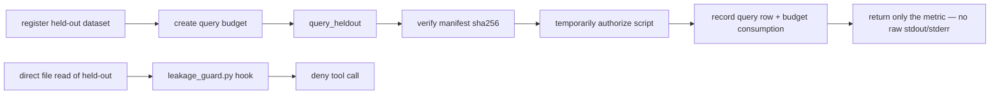

# ClaudeScientist System Overview

> 中文版本: [overview.zh-CN.md](overview.zh-CN.md)
> Five minutes to a complete mental model. After this, [architecture.md](architecture.md) and [tool-reference.md](tool-reference.md) will read much more smoothly.

## 1. One-line positioning

ClaudeScientist is not a standalone research agent. It is **an augmentation layer that bolts onto Claude Code**, giving it persistent memory, verifiable experiment results, an interruptible research loop, and a real-time human-in-the-loop dashboard.

The design assumes Claude Code already does scheduling, dialogue, sub-agents, and tool invocation well enough on its own, so this project only fills in three things: **memory, verification, and a cockpit**.

## 2. What you actually see

Open two terminal windows side by side:

```
┌─────────────────────────┐  ┌─────────────────────────┐
│  Terminal A: Claude     │  │  Terminal B: Cockpit    │
│  Code (chat with AI)    │  │  TUI (monitor/intervene)│
│                         │  │                         │
│  > /research-sop ...    │  │  ┌─ Hypothesis tree ┐   │
│  AI thinks, calls tools │  │  │ ▾ Q ViT scale    │   │
│  AI writes/runs code    │  │  │   ▸ H_07 ...     │   │
│                         │  │  │   ▸ H_08 ...     │   │
│                         │  │  └──────────────────┘   │
│                         │  │  press n=reject y=ok    │
└─────────────────────────┘  └─────────────────────────┘
            │                            │
            └────────┬───────────────────┘
                     ▼
        .research-agent/state.db   ← one SQLite file
```

**The single most important point**: the two terminals **do not talk to each other directly**. Both of them talk to the SQLite file in the middle. This is the central design choice of the entire system — every module collaborates through a shared database file rather than over the network.

## 3. The five roles and where they live

| Role | Where | Job | Analogy |
|---|---|---|---|
| **Claude Code** | Terminal A | Main conductor. Reads your intent, calls tools, writes code | Project manager |
| **MCP servers** | Background subprocesses | Provide "tools" — memory, verification, literature search | Toolbox |
| **Hooks** | Mounted at Claude Code startup | Run scripts automatically before/after tool calls; act as safety gates and bookkeepers | Security checkpoint |
| **Cockpit TUI** | Terminal B | Live state display; lets you intervene by hand | Monitoring screen |
| **SQLite** | `.research-agent/state.db` | Stores everything: hypotheses, evidence, failures, ratings, preregistrations, events | Shared blackboard |

**MCP (Model Context Protocol)** is a wire protocol that lets an AI invoke external Python functions. At startup, Claude Code reads `.claude/settings.json` and spawns several subprocesses: `memory_mcp`, `verify_mcp`, `cockpit.mcp_server`, plus two external packages `arxiv` and `openalex`. They all communicate with Claude over stdio, but **all of them read and write the same SQLite file**.

## 4. End-to-end flow of a research task

Suppose you type into Terminal A: `/research-sop investigate whether dropout affects ViT scaling`


## 5. Three principles that thread the entire design

### 5.1 Single state boundary

All local runtime state lives in one file: `.research-agent/state.db`. Memory, verify, cockpit, and hooks each own their own tables (prefixed `mem_*`, `ver_*`, `cockpit_*`, `res_*`), but cross-module signaling goes through the `cockpit_events` table to avoid modules reaching directly into each other's internals.

The payoff:

- The full system state can be backed up by copying a single file
- Cross-module atomic operations are naturally one SQL transaction
- WAL mode lets multiple processes read and write the same file without blocking each other

### 5.2 Decide first, experiment second, write third

The research mainline is split into three phases that must run in order:

1. **Decision phase**: generate hypotheses → BT tournament ranking → preregister metrics and thresholds
2. **Experiment phase**: budget gate → safety check → run experiment → multi-seed stability check → fairness comparison → provenance record
3. **Writeup phase**: the reviewer agent inspects every numeric claim, demanding all four of: pinned metric, stable seed verdict, met preregistration, fresh provenance

The reviewer rejects any number that cannot trace back to those four anchors. This is how the project enforces "trustworthy results" as an engineering invariant.

### 5.3 Automation only does things that are reversible or auditable

- **Auto-pruning is dry-run by default** — it only emits `branch_pause_suggested` events, never mutates state
- Real pausing requires the explicit env var `RESEARCH_AGENT_AUTO_PRUNE=1`
- Pausing can always be reversed by `resume_branch`
- Counterfactual replay (`replay_counterfactual`) writes only to a separate `mem_replay_branches` table; it never touches the main graph
- Budget consumption, held-out queries, and preregistration resolutions all land in persistent ledgers, leaving an audit trail

## 6. The closed-loop path against data leakage

Held-out data (i.e. test sets) is protected by two complementary mechanisms:



Any attempt to read held-out files directly is blocked by the PreToolUse hook. The only legitimate path is the `query_heldout` MCP tool, which verifies the file fingerprint, decrements the budget, and **returns only the final metric** — no raw output that might leak labels.

## 7. What this project explicitly is *not*

To avoid misinterpretation, here are a few common misreads:

- **Not a complete AI Scientist replacement.** It augments Claude Code; it does not replace your research judgement.
- **Not a browser app.** The cockpit is a terminal TUI. No Vite, no uvicorn, no port to open. This is a deliberate simplification made in v0.2.
- **Not a multi-user system.** The current design assumes a single user with a single session. Optimistic concurrency for multi-session use is on the roadmap.
- **Not yet "production-ready."** All 108 tests pass and ruff is clean, but production readiness needs a fresh end-to-end validation pass.

## 8. One-sentence mental model

> **Claude runs out front, SQLite keeps the books in the middle, Hooks guard the safety gates, and the Cockpit lets you watch and chime in — every module collaborates through that one .db file.**

## 9. Where to read next

- Module contracts and invariants → [`architecture.md`](architecture.md)
- How to use a specific MCP tool → [`tool-reference.md`](tool-reference.md)
- A real scenario walkthrough → [`workflows/first-research-task.md`](workflows/first-research-task.md)
- Where the project is headed → [`roadmap.md`](roadmap.md)
- Historical design decisions → [`archive/README.md`](archive/README.md)
