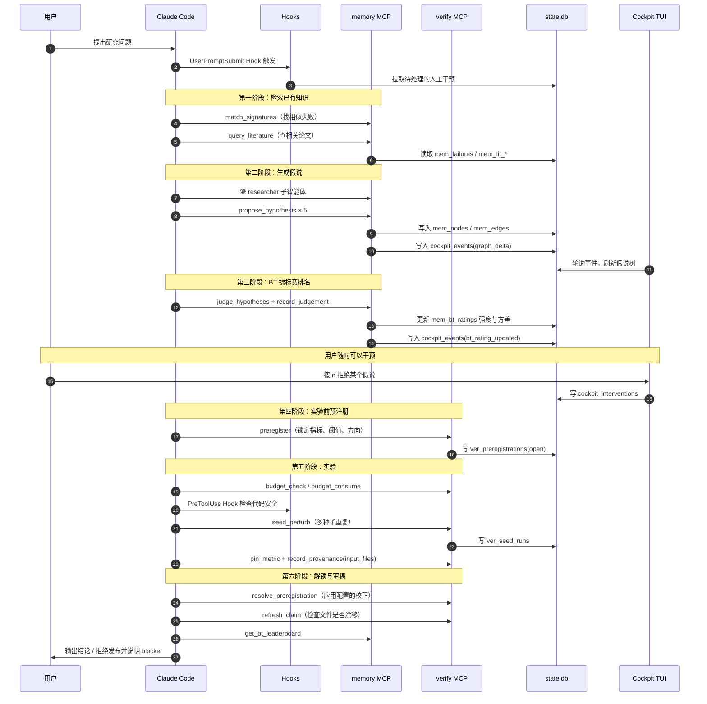
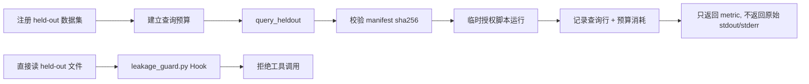

# ClaudeScientist 系统总览

> English version: [overview.md](overview.md)
> 五分钟建立完整心智模型。读完之后再去看 [architecture.zh-CN.md](architecture.zh-CN.md) 或 [tool-reference.zh-CN.md](tool-reference.zh-CN.md) 会顺畅很多。

## 1. 一句话定位

ClaudeScientist 是**给 Claude Code 加装的一层科研增强层**——让它具备持久记忆、可验证的实验结果、可干预的研究过程，以及实时的监控面板。

Claude Code 本身已经把调度、对话、子智能体、工具调用做得很好了，本项目只在上面补四件事：**记忆（memory）、验证（verify）、统计证明生成（prove，v4.0）、监控（cockpit）**。

## 2. 你眼前实际看到什么

打开两个终端窗口，并排放：

```
┌─────────────────────────┐  ┌─────────────────────────┐
│  终端 A: Agent CLI      │  │  终端 B: Cockpit TUI    │
│  Claude Code 或 Codex   │  │  (监控/干预面板)        │
│                         │  │                         │
│  > /research-sop 或 $…  │  │  ┌─ 假说树 ─────┐       │
│  AI 在思考、调工具      │  │  │ ▾ Q ViT scale│       │
│  AI 在写代码、跑实验    │  │  │   ▸ H_07 …   │       │
│                         │  │  │   ▸ H_08 …   │       │
│                         │  │  └──────────────┘       │
│                         │  │  按 n 拒绝 / y 通过     │
└─────────────────────────┘  └─────────────────────────┘
            │                            │
            └────────┬───────────────────┘
                     ▼
        .research-agent/state.db   ← 一个 SQLite 文件
```

**最关键的一点**：左右两个终端**不直接通信**，它们都是和中间那个 SQLite 文件对话。这是整个系统最重要的设计——所有模块通过共享一个数据库文件来协作，而不是通过网络。

### 两个终端各自回答什么（v5.0）

两个终端乍看很像——都在展示"AI 正在做什么"——但它们回答的问题和时间尺度完全不同。搞清楚该看哪个，才不会觉得双窗口是多余的。

| 维度 | 终端 A（Claude Code / Codex） | 终端 B（Cockpit） |
|---|---|---|
| 粒度 | 每次工具调用、每段思考 | 研究阶段、焦点节点、活动卡片 |
| 时间尺度 | 逐 token 实时 | 最近 30 分钟，按阶段 |
| 显示什么 | Claude 的自然语言回复 + 工具输入输出 | 派生状态：阶段栏 + 活动卡片 + 焦点 tab |
| 不显示什么 | 跨主干当前焦点、最近的拒绝/重定向干预 | Claude 具体的思考文本、文件 diff |
| 你在这里做什么 | 回复 Claude，Ctrl-C 中断 | 拒绝 / 批准 / 写批注 / 排队干预 |
| 存储 | agent host 自己的会话状态 | `.research-agent/state.db`（单个 SQLite） |
| 用户姿态 | 对话伙伴 | 研究负责人——抬头监控 |

简单说：终端 A 告诉你 AI 刚*做*了什么，终端 B 告诉你研究当前*是*什么状态。两者各有用处，互不重叠。

## 3. 五个角色与它们的位置

| 角色 | 在哪里 | 职责 | 类比 |
|---|---|---|---|
| **Claude Code** | 终端 A | 主指挥，理解你的需求，调用工具，写代码 | 项目经理 |
| **MCP 服务器** | 后台子进程 | 给 Claude 提供"工具"——记忆、验证、文献检索 | 工具箱 |
| **Hooks** | Claude Code 启动时挂载 | 在工具调用前后自动跑脚本，做安全闸和记账 | 安检门 |
| **Cockpit TUI** | 终端 B | 实时显示状态，让你手动干预 | 监控大屏 |
| **SQLite** | `.research-agent/state.db` | 存放一切：假说、证据、失败、评分、预注册、事件 | 共享黑板 |

**MCP（Model Context Protocol）** 是一种让 AI 能调用外部 Python 函数的协议。Claude Code 启动时会读 `.claude/settings.json`，按里面的配置启动几个子进程：`memory_mcp`、`verify_mcp`、`prove_mcp`（v4.0 证明主干）、`cockpit.mcp_server`，再加上两个外部包 `arxiv` 和 `openalex`，以及可选的 `lean`（按 `docs/setup-lean.zh-CN.md` 自行启用）。它们都通过标准输入输出和 Claude 通话，但**都对同一个 SQLite 文件读写**。

## 4. 一次研究任务的完整流程

在 Codex 里，假设你在终端 A 输入：`$research-sop 研究 dropout 对 ViT 是否有影响`。
如果使用 Claude Code，`/research-sop 研究 dropout 对 ViT 是否有影响` 是同一个流程的快捷入口。



## 5. 三条设计原则

### 5.1 单一状态边界

所有本地运行状态都落到 `.research-agent/state.db` 这一个文件里。memory、verify、cockpit、hooks 各自拥有自己的表（前缀 `mem_*`、`ver_*`、`cockpit_*`、`res_*`），但跨模块通信尽量通过 `cockpit_events` 表完成，避免模块之间直接修改对方的内部表。

这样做的好处：
- 备份整个系统状态只需要复制一个文件
- 多个模块的操作写在同一个 SQL 事务里——要么全成功、要么全回滚
- WAL 模式下，多个进程读写同一文件不会互相阻塞

### 5.2 先决策、再实验、再写作

研究主线被拆成三个阶段。确认性结论要按顺序走完整证据链；探索性实验可以先跑，但必须如实标注为探索性：

1. **决策阶段**：生成假说 → BT 锦标赛排名 → 为确认性运行预注册指标和阈值
2. **实验阶段**：预算门禁 → 安全检查 → 跑实验 → 多种子稳定性验证 → 公平性比较 → 溯源记录
3. **写作阶段**：reviewer 审稿，对发布级核心数字核对 pin、稳定 seed、confirmatory 声明的 met 预注册、未漂移的 provenance；上下文数字和探索性结果要求清楚标注

写作阶段的 reviewer 会拒绝无法回溯到相关证据锚点的发布级核心声明。这把硬门集中在用户真正会发表的结论上，同时保留探索笔记和运行上下文的可用性。

### 5.3 自动化只做可逆或可审计的事

- **自动剪枝默认只是建议**——只发出 `branch_pause_suggested` 事件，不动数据
- 真正的暂停需要显式开启环境变量 `RESEARCH_AGENT_AUTO_PRUNE=1`
- 暂停可以通过 `resume_branch` 反转
- 反事实回放（`replay_counterfactual`）只写入独立的 `mem_replay_branches` 表，不污染主图
- 预算消耗、held-out 查询、预注册解锁全部写入持久 ledger，留下审计痕迹

## 6. 防数据泄漏的闭环路径

held-out 数据集（即测试集）受到双重保护：



任何尝试直接读取 held-out 数据的工具调用都会被 PreToolUse Hook 拦截。唯一的合法访问路径是 `query_heldout` MCP 工具——它会校验文件指纹、扣减预算、并且**只返回最终指标**，不返回可能含有标签泄漏的原始输出。

## 7. 这个项目"明确不是"什么

为了避免误解，这里列出几个常见误判：

- **不是完整的 AI Scientist 替代品**。它增强 Claude Code——研究判断仍然是你的。
- **不是浏览器应用**。Cockpit 是终端 TUI，不需要 Vite、不需要 uvicorn、不占端口。这是 v0.2 中刻意做出的简化。
- **不是多用户系统**。当前设计假定单用户单会话；多会话并发的乐观锁还在路线图上。
- **还不能对外宣称 "production-ready"**。测试通过、ruff 干净，但生产就绪需要一次完整的端到端验证。

## 8. 一句话心智模型

> **Claude 在前面跑，SQLite 在中间记账，Hooks 守着安全门，Cockpit 让你看着并能随时插话——所有模块的协作都通过那一个 .db 文件。**

## 9. 接下来读什么

- 想了解模块间的契约和不变量 → [`architecture.zh-CN.md`](architecture.zh-CN.md)
- 想查具体某个 MCP 工具怎么用 → [`tool-reference.zh-CN.md`](tool-reference.zh-CN.md)
- 想跟着一个真实场景走一遍 → [`workflows/first-research-task.zh-CN.md`](workflows/first-research-task.zh-CN.md)
- 想了解项目要往哪走 → [`roadmap.zh-CN.md`](roadmap.zh-CN.md)
- 想了解项目演进的历史决策 → [`archive/README.zh-CN.md`](archive/README.zh-CN.md)
