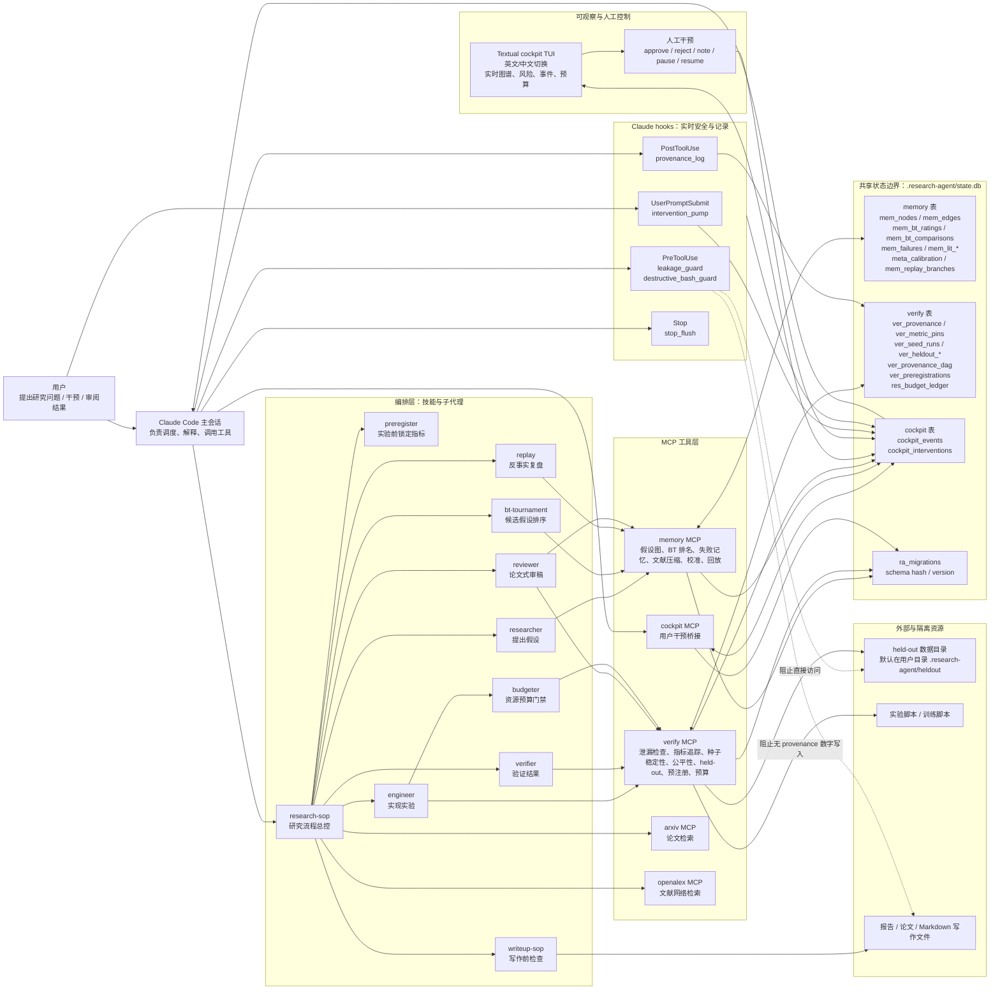
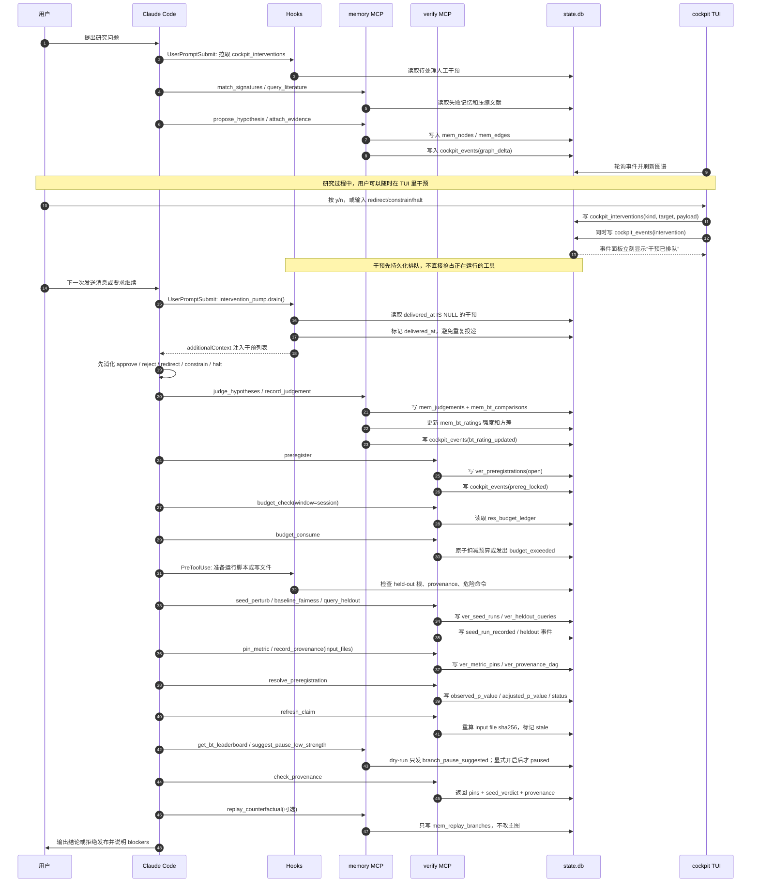
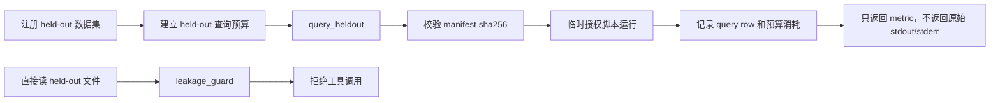

# ClaudeScientist 系统交互过程与逻辑图

本文是一张面向后续开发者和使用者的系统总览图。重点不是列文件，而是解释一次研究任务如何在 Claude Code、MCP、hooks、SQLite 状态库、cockpit TUI 和验证机制之间流动。

## 1. 总览图

## 2. 一次研究任务的典型时序

## 3. 核心机制索引

| 机制 | 作用 | 主要入口 | 写入状态 | 设计约束 |
|---|---|---|---|---|
| 假设图谱 | 保存问题、假设、证据、反驳关系 | `propose_hypothesis`, `attach_evidence`, `mark_refuted` | `mem_nodes`, `mem_edges` | cockpit 通过 `graph_delta` 实时看到变化 |
| Bradley-Terry 排名 | 用成对比较形成可持续更新的假设强度 | `record_judgement`, `update_bt_rating`, `get_bt_leaderboard` | `mem_bt_ratings`, `mem_bt_comparisons` | 只比较 hypothesis；`elo_score` 仅兼容旧读者 |
| 实时暂停建议 | 发现低上界假设，建议暂停 | `suggest_pause_low_strength`, `resume_branch` | `mem_bt_ratings.status`, `cockpit_events` | 默认 dry-run；只有 `RESEARCH_AGENT_AUTO_PRUNE=1` 才真正暂停 |
| 预注册 | 实验前锁定指标、方向、阈值和多重比较校正 | `preregister`, `resolve_preregistration` | `ver_preregistrations` | 先锁定再实验；保存 raw p 和 adjusted p |
| 指标与来源 | 给数字结论建立可审计证据链 | `record_provenance`, `pin_metric`, `check_provenance` | `ver_provenance`, `ver_metric_pins` | `check_provenance` 返回 pin、seed verdict 和来源 |
| Provenance DAG | 检测输入文件是否漂移 | `record_provenance(input_files=...)`, `refresh_claim` | `ver_provenance_dag` | stale 是写作硬阻断项 |
| 种子稳定性 | 检查指标是否对随机种子敏感 | `seed_perturb` | `ver_seed_runs` | reviewer 只接受 stable 的核心指标 |
| Baseline 公平性 | 防止新方法用了更多训练预算却和 baseline 比 | `baseline_fairness` | 只返回检查结果 | 超预算比例会成为验证风险 |
| held-out 防泄漏 | 受控查询保留测试集，阻止直接读取 | `query_heldout`, `leakage_guard.py` | `ver_heldout_budgets`, `ver_heldout_queries` | 直接文件访问由 hook 拦截；失败查询也消耗预算 |
| 资源预算 | 控制 wallclock、tokens、held-out 查询和磁盘 | `budget_check`, `budget_consume` | `res_budget_ledger` | 边界是 `(scope, resource, window)` |
| 失败记忆 | 记录重复失败，下一次先检索 | `record_failure`, `match_signatures` | `mem_failures` | 防止重复踩坑 |
| 校准 | 记录 agent 自信度和真实结果 | `record_calibration`, `calibration_report` | `meta_calibration` | 用 reliability diagram / Brier score 看 agent 是否过度自信 |
| 反事实回放 | 对过去快照做“如果当时选另一条路”复盘 | `snapshot`, `replay_counterfactual`, `list_replay_branches` | `mem_snapshots`, `mem_replay_branches` | 不改 `mem_nodes` 和 `mem_bt_ratings` 主状态 |
| cockpit TUI | 实时观察图谱、事件、风险和人工干预 | `python -m cockpit.tui` | 读写 `cockpit_events`, `cockpit_interventions` | 终端优先；中英文标签走 `cockpit.i18n` |
| hooks | 在工具调用前后做安全控制和记录 | PreToolUse / PostToolUse / UserPromptSubmit / Stop | 多个状态表和事件表 | 防 held-out 泄漏、防危险命令、记录 provenance、刷新干预 |

## 4. 关键设计逻辑

### 4.1 单一状态边界

所有本地运行状态都落到 `.research-agent/state.db`。memory、verify、cockpit 和 hooks 各自拥有表，但跨模块通信尽量通过 `cockpit_events`，避免模块之间直接互相改内部表。

### 4.2 先决策，再实验，再写作

研究主线是：

1. 先生成和记录假设。
2. 用 BT tournament 给候选假设排序，并保留不确定性区间。
3. 在实验前预注册指标和阈值。
4. 运行实验前先过预算门禁。
5. 实验结果必须经过 seed stability、baseline fairness、provenance 和 held-out 保护。
6. 写作前 reviewer 检查每个核心数字是否有 pin、stable seed verdict、met prereg、fresh provenance。

### 4.3 自动化只做可逆或可审计的事

- 自动剪枝默认只是建议，不改变状态。
- 真正暂停需要显式环境变量。
- 暂停可以通过 `resume_branch` 反转。
- 反事实 replay 不改主图，只产生一个 replay branch。
- 预算消耗、held-out 查询、预注册 resolution 都写入持久 ledger。

### 4.4 防泄漏路径是闭环

held-out 数据不能被脚本或 agent 直接读。正确路径是：

### 4.5 当前明确不是浏览器产品

cockpit 是 Textual TUI，支持 `--lang en|zh` 和运行时按 `L` 切换语言。当前没有支持的浏览器前端，也没有需要启动的 `uvicorn` 或 Vite 服务。

## 5. 一句话心智模型

ClaudeScientist 把 Claude Code 的研究流程变成一个“带记忆、带预算、带预注册、带验证、可人工干预的本地研究控制回路”：Claude 负责推理和调度，MCP 负责结构化读写，hooks 负责实时守门，SQLite 负责可审计状态，cockpit 负责观察和干预。
